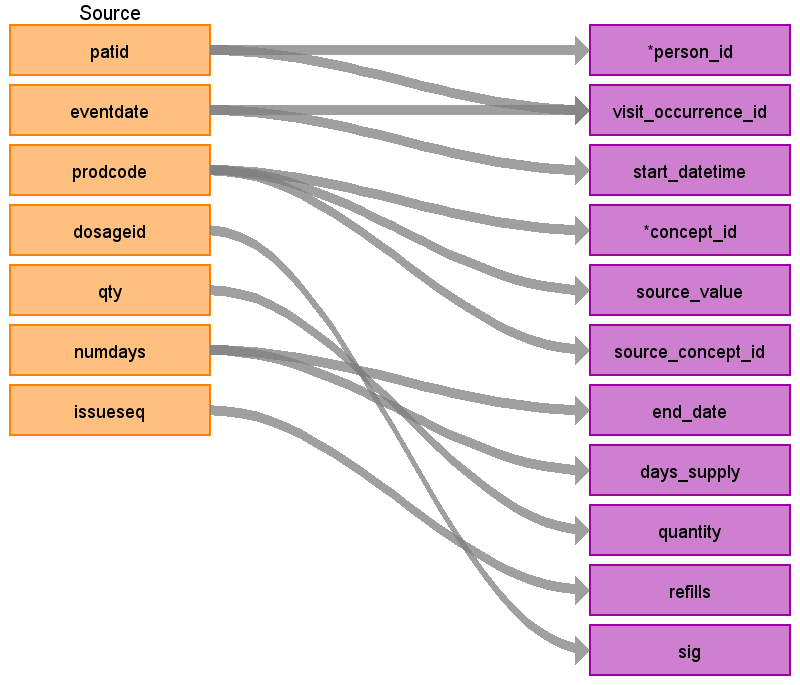

# CDM Table name: stem_table

The STEM table is a staging area where CPRD source codes like Read codes will first be mapped to concept_ids. The STEM table itself is an amalgamation of the OMOP event tables to facilitate record movement. This means that all fields present across the OMOP event tables are present in the STEM table. After a record is mapped and staged, the domain of the concept_id dictates which OMOP table (Condition_occurrence, Drug_exposure, Procedure_occurrence, Measurement, Observation, Device_exposure) the record will move to. Please see the STEM -> CDM mapping files for a description of which STEM fields move to which STEM tables. 

## Reading from CPRD.Therapy

It was necessary to impute drug_exposure_end_date in the drug_exposure table in order to facilitate creation of the CDM Drug_era table. Though it is best in the CDM not to impute data, there is no way to create the drug eras without imputing in this case, as only approximately 7% of records have valid days supplied or duration values (numdays) in the CPRD therapy file. It is difficult to systematically impute duration for drug exposures in CPRD as the ‘numdays’ field is not consistently entered and the quantity divided by numeric daily dose (fields available more frequently than ‘numdays’ in the raw CPRD data) does not consistently create a valid duration for a particular drug exposure. The imputation method below was decided upon, using most common ‘numdays’ for duration for a particular combination of ‘prodcode’, ‘daily_dose’ (available from the commondosages table joining to therapy on dosageid), ‘qty’ and ‘numpacks’ using the ‘daily_dose’ and ‘qty’ fields to validate the imputations.
The imputing process is as follows: first if the ‘numdays’ field is populated with valid data (>0 and <365), that will become the days supplied.  Then the most common days supplied in the data for each combination of prodcode, daily_dose, qty, and numpack (null values for any of the fields are converted to 0) is used if numdays is 0 or >365 (in table Daysupply_Decodes).  If a combination does not have a valid ‘numdays’ value in the data, then the modal days supplied is used for each prodcode (Daysupply_Modes).  Lastly, if there are not valid days supplied in the data for a particular prodcode, we will use assume the product was used for one day only.  We created a process to validate the drug duration imputations which is described here:

Matcho A, Ryan P, Fife D, Reich C. Fidelity assessment of a clinical practice research datalink conversion to the OMOP common data model. Drug safety : an international journal of medical toxicology and drug experience. Nov 2014;37(11):945-959.

Mapping statistics for all domains are also described in the above publication (% codes mapped, % data in domain mapped, top 100 code validations etc.) 

The days_supply field in the drug_exposure table will hold the original ‘numdays’ value, no imputation will be done for this field.  Numdays values of 0 (93% of data) and >365 (.0004% of data) will be considered invalid.  Drug_exposure_start_date plus imputed days supplied minus one will be the value of drug_exposure_end_date.  One day is being subtracted from the total because we are considering day 1 of drug exposure to be the start date. 

| Destination Field | Source field | Logic | Comment field |
| --- | --- | :---: | --- |
| id |  |  | Autogenerate |
| domain_id |  |This should be the domain_id of the standard concept in the concept_id field. If a read code is mapped to concept_id 0, put the domain_id as Observation.  |  |
| person_id | patid | Use patid to lookup Person_id |  |
| visit_occurrence_id | eventdate  patid consid | Look up visit_occurrence_id based on the unique patid, consid, and eventdate. | Use the Visit_occurrence_id assigned in the previous visit definition step |
| provider_id |  |  |  |
| start_datetime | eventdate | Set time as midnight | |
| concept_id | prodcode | Use the prodcode to find the associated gemscript code in the product table. Find the standard concept_id associated with the gemscript using the [SOURCE_TO_STANDARD](https://github.com/OHDSI/ETL-LambdaBuilder/blob/master/docs/Standard%20Queries/SOURCE_TO_STANDARD.sql) query with the filters:      WHERE source_vocabulary_id in ('gemscript')  and eventdate between valid_start_date and valid_end_date  and standard_concept = 'S'      Look for an Rxnorm mapping first, if one does not exist then look in the RxNorm_Extension vocabulary.    If a gemscript does not have a standard map, set this to 0 | Use the query [CPRD_Therapy_Prodcodes.sql](https://github.com/OHDSI/ETL-LambdaBuilder/blob/master/docs/CPRD/Queries/CPRD_Therapy_Prodcodes.sql) to get an idea of the domains covered by the prodcodes and how to join to the product table.  |
| source_value | prodcode | Use the prodcode to find the associated gemscript code in the product table. Use the gemscript as the source_value | |
| source_concept_id | prodcode | Use the prodcode to find the associated gemscript code in the product table. Find the concept_id associated with the gemscript using the [SOURCE_TO_SOURCE](https://github.com/OHDSI/ETL-LambdaBuilder/blob/master/docs/Standard%20Queries/SOURCE_TO_SOURCE.sql) query with the filters:      WHERE source_vocabulary_id in ('gemscript')  and eventdate between valid_start_date and valid_end_date | |
| type_concept_id |  | Use the following type concepts based on the **domain** of the concept_id:      Condition - **32020** EHR encounter diagnosis.    Observation - **38000280** Observation recorded from EHR.    Procedure - **38000275** EHR order list entry.    Measurement - **44818702** Lab result.    Drug - **38000177** prescription written.    If concept vocabulary_id is 'CVX' then **38000179** - Physician administered drug (identified as procedure).  | |
| end_date | numdays | Follow the imputation logic as described above. |  |
| sig | dosageid | Use dosageid as a lookup in the commondosages table and store the field 'text' from the commondosages table here. |  |
