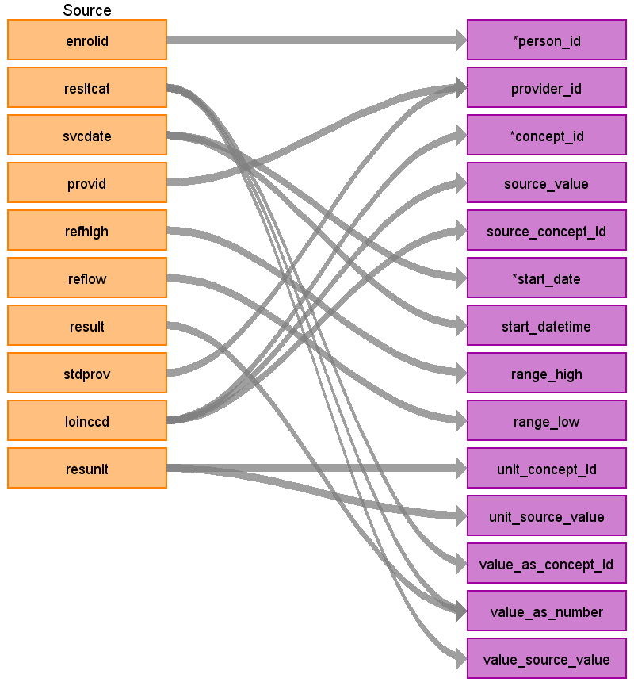

## Table name: stem_table

### Key conventions
* Lab Observations from **LAB** are tracked using LOINC codes. 
* Lab data from other tables come from DX and PROC fields that have been mapped to standard concepts with DOMAIN_IDs of ‘Measurement’.
* Units are mapped to UNIT_CONCEPT_IDs in the OMOP **VOCABULARY** (VOCABULARY_ID = UCUM - Unified Code for Units of Measure).  Please note that mapping a UNIT_SOURCE_VALUE to a UNIT_CONCEPT_ID is both case sensitive and accent sensitive.
* LOINCs
    * Valid LOINC codes have the following layouts #-#, ##-#, ###-#, ####-#, and #####-# .
    * When mapping to valid LOINCs in the OMOP Vocabulary there are a few invalid LOINC codes.  Implementing a check for the second to last character is a ‘-‘ensures you pull a valid LOINC from the **VOCABULARY**.  
* Only use records with SVCDATE that fall within an OBSERVATION_PERIOD available for this person.
* Lab result in **LAB** is stored in three fields: ABNORMAL, RESULT (numeric) and RESLTCAT (character). Numeric results can be in both RESULT and RESLTCAT. RESULT usually has the following values if the lab result is string: 0 or large negative value (<-999999.99999).  ABNORMAL is the abnormal indicator set by the lab vendors: ‘A’ means “abnormal”, ‘N’ means “normal”, ‘H’ means “Above the normal range”, ‘L’ means “Below the normal range”, ‘+’ means “Positive” and ‘-’ means “Negative”.  
* For VALUE_AS_CONCET_ID: 
`/*Result as string*/` `VALUE_AS_STRING = CATS(RESLTCAT);` `/*Result as concept code*/` `IF UPCASE(VALUE_AS_STRING) ='LOW' OR ABNORMAL ='L' 	THEN VALUE_AS_CONCEPT_ID = 4267416;` `ELSE IF UPCASE(VALUE_AS_STRING) ='HIG' OR ABNORMAL ='H' THEN VALUE_AS_CONCEPT_ID =4328749;` `ELSE IF UPCASE(VALUE_AS_STRING) ='NRM' OR ABNORMAL ='N' THEN VALUE_AS_CONCEPT_ID =4069590;` `ELSE IF UPCASE(VALUE_AS_STRING) ='ABN' OR ABNORMAL ='A' THEN VALUE_AS_CONCEPT_ID =4135493;` `ELSE IF UPCASE(VALUE_AS_STRING) ='ABS' THEN VALUE_AS_CONCEPT_ID =4132135;` `ELSE IF UPCASE(VALUE_AS_STRING) ='PRS' THEN VALUE_AS_CONCEPT_ID =4181412;` `ELSE IF UPCASE(VALUE_AS_STRING) ='POS' OR ABNORMAL ='+' THEN VALUE_AS_CONCEPT_ID =9191;` `ELSE IF UPCASE(VALUE_AS_STRING) ='NEG' OR ABNORMAL ='-' THEN VALUE_AS_CONCEPT_ID =9189;` `ELSE IF UPCASE(VALUE_AS_STRING) IN ('FIN','FIR') THEN VALUE_AS_CONCEPT_ID =9188;` `ELSE IF UPCASE(VALUE_AS_STRING) ='NON' THEN VALUE_AS_CONCEPT_ID =9190;` `ELSE IF UPCASE(VALUE_AS_STRING) ='TRA' THEN VALUE_AS_CONCEPT_ID = 9192;` `IF RESULT NE 0 AND RESULT > -999999.99999 THEN DO;` `/*Result as number*/` `VALUE_AS_NUMBER = RESULT;` `END;`

### Reading from **LAB**

| Destination Field | Source field | Logic | Comment field |
| --- | --- | --- | --- |
| DOMAIN_ID | - | NULL | - |
| PERSON_ID | ENROLID | - | - |
| VISIT_OCCURRENCE_ID | - | NULL | - |
| VISIT_DETAIL_ID | - | NULL | - |
| PROVIDER_ID | PROVID STDPROV | Map STDPROV and PROVID  to PROVIDER_SOURCE_VALUE and SPECIALTY_SOURCE_VALUE in **PROVIDER** table to extract associated Provider ID.  If there is no associated PROVIDER_ID then set as NULL | - |
| ID | - | System generated. | - |
| CONCEPT_ID | LOINCCD | Use the <a href="https://ohdsi.github.io/CommonDataModel/sqlScripts.html">Source-to-Standard Query</a>.   `WHERE SOURCE_VOCABULARY_ID IN ('LOINC')` `AND TARGET_STANDARD_CONCEPT IS NOT NULL` | - |
| SOURCE_VALUE | LOINCCD | The LOINCCD as it appears in the **LAB** table | - |
| SOURCE_CONCEPT_ID | LOINCCD | Use the <a href="https://ohdsi.github.io/CommonDataModel/sqlScripts.html">Source-to-Source Query</a>.   `WHERE SOURCE_VOCABULARY_ID IN (‘LOINC’)` `AND TARGET_VOCABULARY_ID IN (‘LOINC’)` | - |
| TYPE_CONCEPT_ID | - | All rows will have CONCEPT_ID `44818702` | `44818702` = 'Lab Result' |
| START_DATE | SVCDATE | - | - |
| START_DATETIME | SVCDATE | SVCDATE + Midnight | - |
| END_DATE | - | NULL | - |
| END_DATETIME | - | NULL | - |
| VERBATIM_END_DATE | - | NULL | - |
| DAYS_SUPPLY | - | NULL | - |
| DOSE_UNIT_SOURCE_VALUE | - | NULL | - |
| LOT_NUMBER | - | NULL | - |
| MODIFIER_CONCEPT_ID | - | NULL | - |
| MODIFIER_SOURCE_VALUE | - | NULL | - |
| OPERATOR_CONCEPT_ID | - | 0 | - |
| QUANTITY | - | NULL | - |
| RANGE_HIGH | REFHIGH | - | - |
| RANGE_LOW | REFLOW | - | - |
| REFILLS | - | NULL | - |
| ROUTE_CONCEPT_ID | - | 0 | - |
| ROUTE_SOURCE_VALUE | - | NULL | - |
| SIG | - | NULL | - |
| STOP_REASON | - | NULL | - |
| UNIQUE_DEVICE_ID | - | NULL | - |
| UNIT_CONCEPT_ID | RESUNIT | Use the <a href="https://ohdsi.github.io/CommonDataModel/sqlScripts.html">Source-to-Standard Query</a>.   Filters: `WHERE SOURCE_VOCABULARY_ID IN ('UCUM')`   `AND TARGET_VOCABULARY_ID IN ('UCUM')` `AND TARGET_INVALID_REASON IS NULL`  If you do not get a map from UCUM use the JNJ_UNITS. | - |
| UNIT_SOURCE_VALUE | RESUNIT | RESUNIT as it appears in the **LAB** table | - |
| VALUE_AS_CONCEPT_ID | RESLTCAT | Refer to logic above for defining this field. | - |
| VALUE_AS_NUMBER | RESULT RESLTCAT | Refer to logic above for defining this field.   For the following LOINCs (3142-7, 29463-7, 3141-9) if the RESULT > 100000 and the last digits are 0000 and RESUNIT = ‘LBS’, trim the last for digits 0000. | - |
| VALUE_AS_STRING | RESULT RESLTCAT | Refer to logic above for defining this field. | - |
| VALUE_SOURCE_VALUE | RESLTCAT | RESLTCAT as it appears in the **LAB** table. | - |
| ANATOMIC_SITE_CONCEPT_ID | - | 0 | - |
| DISEASE_STATUS_CONCEPT_ID | - | 0 | - |
| SPECIMIN_SOURCE_ID | - | NULL | - |
| ANATOMIC_SITE_SOURCE_VALUE | - | NULL | - |
| DISEASE_STATUS_SOURCE_VALUE | - | NULL | - |
| CONDITION_STATUS_CONCEPT_ID | - | 0 | - |
| CONDITION_STATUS_SOURCE_VALUE | - | NULL | - |
| EVENT_ID | - | NULL | - |
| EVENT_FIELD_CONCEPT_ID | - | 0 | - |
| VALUE_AS_DATETIME | - | NULL | - |
| QUALIFIER_CONCEPT_ID | - | 0 | - |
| QUALIFIER_SOURCE_VALUE | - | NULL | - |
