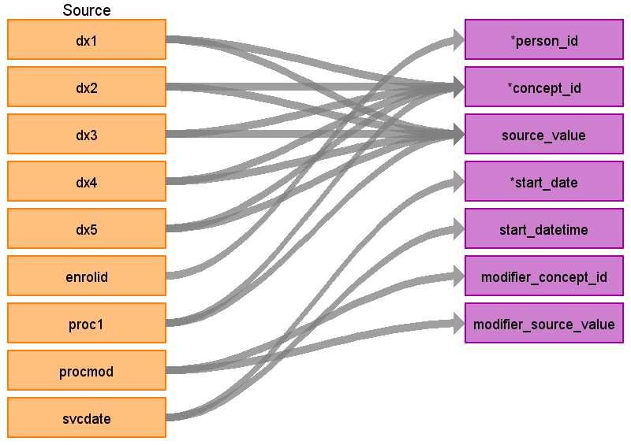

## Table name: **STEM_TABLE**

### Key conventions
* Even though MarketScan defines inpatient visits, some inpatient visits still exist in **OUTPATIENT_SERVICES** table.  We kept those inpatient visits defined in MarketScan, and also applied the logic derived to define inpatient visits versus emergency room visits from the following reference: 
    * *Scerbo, M., C. Dickstein, and A. Wilson, Health Care Data and SAS. 2001, Cary, NC: SAS Institute Inc.*
    * Visits are only generated off the **OUTPATIENT_SERVICES** and **INPATIENT_SERVICES** tables, **FACILITY_HEADER** and **INPATIENT_ADMISSIONS** tables are not used. 
    * Within observation periods where a person has both prescription benefits and medical benefits extract records from **INPATIENT_SERVICES** and **OUTPATIENT_SERVICES** tables.  This data is stored in a table called **TEMP_MEDICAL** that will be used to populate all future tables.
        * Set Source Flag: To retain the knowledge for later, set this flag to ‘I’ for all **INPATIENT_SERVICES** records and ‘O’ to all **OUTPATIENT_SERVICES** records.

### Reading from **OUTPATIENT_SERVICES**

| Destination Field | Source field | Logic | Comment field |
| --- | --- | --- | --- |
| DOMAIN_ID | - | NULL | - |
| PERSON_ID | ENROLID | - | - |
| VISIT_OCCURRENCE_ID | - | Refer to logic in building VISIT_OCCURRENCE table for linking with VISIT_OCCURRENCE_ID. | - |
| VISIT_DETAIL_ID | - | Refer to logic in building VISIT_DETAIL table for linking with VISIT_DETAIL_ID. | - |
| PROVIDER_ID | - | Refer to logic in building VISIT_OCCURRENCE table for assigning VISIT_PROVID and VISIT_PROVSTD, and map them to PROVIDER_SOURCE_VALUE and   SPECIALTY_SOURCE_VALUE in Provider table to extract associated Provider ID. | -|
| ID | - | System generated. | - |
| CONCEPT_ID | DX1-5 PROC1 | Use the <a href="https://ohdsi.github.io/CommonDataModel/sqlScripts.html">Source-to-Standard Query</a>.    If DXVER does not have a value, review to the "Key Conventions" under the "STEM Key Conventions and Lookup Files" page.  If no map is made, assign to 0.  **[DX1-5]** If DXVER=9 use the filter:  `WHERE SOURCE_VOCABULARY_ID IN (‘ICD9CM’)` `AND TARGET_STANDARD_CONCEPT = 'S'`  If DXVER=0 use the filter: `WHERE SOURCE_VOCABULARY_ID IN (’ICD10CM’)` `AND TARGET_STANDARD_CONCEPT = 'S'`   **[PROC1]** When PROCTYP <> 0:   `WHERE SOURCE_VOCABULARY_ID IN ('ICD9Proc','HCPCS','CPT4',’ICD10PCS’)` `AND TARGET_STANDARD_CONCEPT = 'S'` | - |
| SOURCE_VALUE | DX1-5 PROC1 | - | - |
| SOURCE_CONCEPT_ID | DX1-5 PROC1 | Use the <a href="https://ohdsi.github.io/CommonDataModel/sqlScripts.html">Source-to-Source Query</a>.    If DXVER does not have a value, review to the "Key Conventions" under the "STEM Key Conventions and Lookup Files" page.  If no map is made, assign to 0.  **[DX1-5]** If DXVER=9 use the filter:  `WHERE SOURCE_VOCABULARY_ID IN (‘ICD9CM’)` `AND TARGET_VOCABULARY_ID IN (‘ICD9CM’)`  If DXVER=0 use the filter: `WHERE SOURCE_VOCABULARY_ID IN (’ICD10CM’)` `AND TARGET_VOCABULARY_ID IN (’ICD10CM’)`   **[PROC1]** When PROCTYP <> 0:   `WHERE SOURCE_VOCABULARY_ID IN ('ICD9Proc','HCPCS','CPT4',’ICD10PCS’)` `AND TARGET_VOCABULARY_ID IN ('ICD9Proc','HCPCS','CPT4',’ICD10PCS’)`| - |
| TYPE_CONCEPT_ID | - | Refer to "Condition Type Concept ID Lookup" and "Procedure Type Concept ID Lookup" on the "STEM Key Conventions and Lookup Files" page. | - |
| START_DATE | SVCDATE | If a date is not defined, use VISIT_START_DATE. | - |
| START_DATETIME | SVCDATE | START_DATE + midnight | - |
| END_DATE | - | NULL | - |
| END_DATETIME | - | NULL | - |
| VERBATIM_END_DATE | - | NULL | - |
| DAYS_SUPPLY | - | NULL | - |
| DOSE_UNIT_SOURCE_VALUE | - | NULL | - |
| LOT_NUMBER | - | NULL | - |
| MODIFIER_CONCEPT_ID | PROCMOD | Use the <a href="https://ohdsi.github.io/CommonDataModel/sqlScripts.html">Source-to-Standard Query</a>.  `WHERE SOURCE_CONCEPT_CLASS_ID IN ('CPT4 Modifier')`  `AND TARGET_CONCEPT_CLASS_ID IN ('CPT4 Modifier')` | If PROCMOD is blank then leave this field blank as well |
| MODIFIER_SOURCE_VALUE | PROCMOD | - | - |
| OPERATOR_CONCEPT_ID | - | 0 | - |
| QUANTITY | - | NULL | - |
| RANGE_HIGH | - | NULL | - |
| RANGE_LOW | - | NULL | - |
| REFILLS | - | NULL | - |
| ROUTE_CONCEPT_ID | - | 0 | - |
| ROUTE_SOURCE_VALUE | - | NULL | - |
| SIG | - | NULL | "Sig" is short for the Latin, signetur, or "let it be labeled." |
| STOP_REASON | - | NULL | - |
| UNIQUE_DEVICE_ID | - | NULL | - |
| UNIT_CONCEPT_ID | - | 0 | - |
| UNIT_SOURCE_VALUE | - | NULL | - |
| VALUE_AS_CONCEPT_ID | - | 0 | - |
| VALUE_AS_NUMBER | - | NULL | - |
| VALUE_AS_STRING | - | NULL | - |
| VALUE_SOURCE_VALUE | - | NULL | - |
| ANATOMIC_SITE_CONCEPT_ID | - | 0 | - |
| DISEASE_STATUS_CONCEPT_ID | - | 0 | - |
| SPECIMEN_SOURCE_ID | - | NULL | - |
| ANATOMIC_SITE_SOURCE_VALUE | - | NULL | - |
| DISEASE STATUS_SOURCE_VALUE | - | NULL | - |
| CONDITION_STATUS_CONCEPT_ID | - | 0 | - |
| CONDITION_STATUS_SOURCE_VALUE | - | NULL | - |
| EVENT_ID | - | NULL | - |
| EVENT_FIELD_CONCEPT_ID | - | 0 | - |
| VALUE_AS_DATETIME | - | NULL | - |
| QUALIFIER_CONCEPT_ID | - | 0 | - |
| QUALIFIER_SOURCE_VALUE | - | NULL | - |