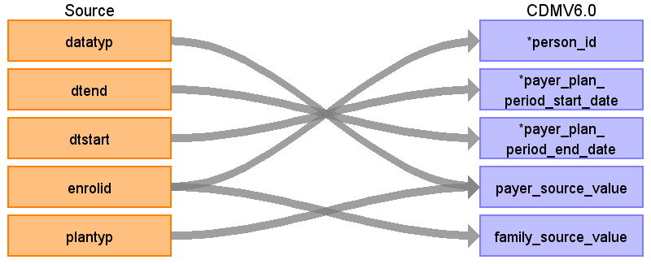

## Table name: **PAYER_PLAN_PERIOD**

### Key conventions

* For each person, create a record associating the person to the duration they were on a specific type of benefit plan (defined by DATATYP, and PLANTYP) per the **ENROLLMENT_DETAIL** table. Payer plan entries are consolidated by combining records that indicate continuous enrollment over a period for a specific payer plan.  Consolidation is done through the following steps:
    * Define the PAYER_SOURCE_VALUE (see logic in table below).  
    * **ENROLLMENT_DETAIL** records for each person are sorted in ascending order by DTSTART, DTEND.
    * Periods of continuous enrollment are consolidated by combining monthly records as long as the time between the end of one enrollment period and the start of the next is 32 days or less (<=32) and PAYER_SOURCE_VALUE have not changed.
    * Only use records where the person has prescription benefits (DRUGCOVG=1) or eligible for both Medicaid and Medicare coverage (MEDICARE=1).
    * The gap between plan periods needs to be 32 days or less (<=32).  
    * Use MEDICARE (1 means eligible for both Medicaid and Medicare coverage), CAP (1 means capitated plan) and PLANTYP (e.g. HMO, PPO, etc.) to define PAYER_SOURCE_VALUE. 
    * Switch of type of plan (PAYER_SOURCE_VALUE) enrolled may cause the overlap of enroll periods on two plans: Sort ENROLLMENT_DETAIL table by ENROLID, DTSTART and DTEND, and if there is some overlap between two coverage periods, always truncate the first one and discard the first record if DTEND <DSTART after truncation. 
    * Payer plans may break out differently than observation periods, the amount of observation time and payer plan period time may not match for each person.
    * Remove duplicate records before assigning PAYER_PLAN_PERIOD_ID.

 

### Reading from **ENROLLMENT_DETAIL**

| Destination Field | Source field | Logic | Comment field |
| --- | --- | --- | --- |
| PAYER_PLAN_PERIOD_ID | - | System generated. | - |
| PERSON_ID | ENROLID | - | - |
| CONTRACT_PERSON_ID | - | NULL | - |
| PAYER_PLAN_PERIOD_START_DATE | DTSTART | Minimum start date of a contiguous enrollment in a plan. | - |
| PAYER_PLAN_PERIOD_END_DATE | DTEND | Maximum end date of a contiguous enrollment in a plan. | - |
| PAYER_CONCEPT_ID | - | 0 | - |
| PAYER_SOURCE_VALUE | MEDICARE CAP PLANTYP  | Use PLANTYP string:    1 - Basic/major medical   2 - Comprehensive   3 - EPO   4 - HMO   5 - POS   6 - PPO   7 - POS with capitation   8 - CDHP   9 - HDHP       If MEDICARE =’1’ then replace  [1] with “D”; else replace [1] with “N”;   If CAP =’1’  then replace  [2] replace with “C”; else replace [2] with “N”;     Replace [3] with “Medicaid”. | NULL:  Unknown   1: [1]  [2]  [3] Basic/Major Medical   2: [1]  [2]  [3] Comprehensive   3: [1]  [2]  [3] EPO   4: [1]  [2] [3] HMO   5: [1] [2]  [3] POS   6: [1]  [2]  [3] PPO   7: [1]  [2]  [3] POS with Capitation   8: [1]  [2]  [3] CDHP   9: [1]  [2]  [3] HDHP |
| PAYER_SOURCE_CONCEPT_ID | - | 0 | - |
| PLAN_CONCEPT_ID | - | 0 | - |
| PLAN_SOURCE_VALUE | - | NULL | - |
| PLAN_SOURCE_CONCEPT_ID | - | 0 | - |
| CONTRACT_CONCEPT_ID | - | 0 | - |
| CONTRACT_SOURCE_VALUE | - | NULL | - |
| CONTRACT_SOURCE_CONCEPT_ID | - | 0 | - |
| SPONSOR_CONCEPT_ID | - | 0 | - |
| SPONSOR_SOURCE_VALUE | - | NULL | - |
| SPONSOR_SOURCE_CONCEPT_ID | - | 0 | - |
| FAMILY_SOURCE_VALUE | - | NULL |  |
| STOP_REASON_CONCEPT_ID | - | 0 | - |
| STOP_REASON_SOURCE_VALUE | - | NULL | - |
| STOP_REASON_SOURCE_CONCEPT_ID | - | 0 | - |