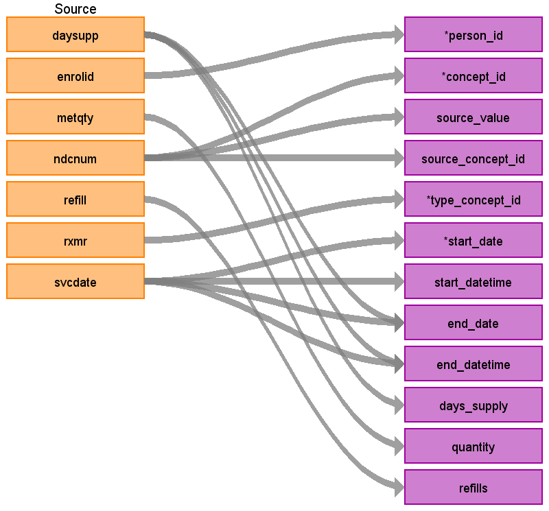

## Table name: **STEM_TABLE**

### Key conventions
* Keep records with SVCDATE that fall within an OBSERVATION_PERIOD available for this person.
* Remove duplicate records: Find all distinct records via the following columns: ENROLID, PAYER_PLAN_PERIOD_ID, NDCNUM, FILL_DATE,  METQTY, DAYSUPP, COPAY, COINS, DEDUCT, NETPAY, COB, INGCOST, DISPFEE, AWP, REFILL.
* From the previous distinct, group by ENROLID, NDCNUM, SVCDATE and sum the following columns together for the DRUG_EXPOSURE table: SUM(METQTY) as QUANTITY, SUM(DAYSUPP) as DAYS_SUPPLY, SUM(COPAY) as PAID_COPAY, SUM(COINS) as PAID_COINSURANCE, SUM(DEDUCT) as PAID_TOWARD_DEDUCTIBLE,SUM(NETPAY) as PAID_BY_PAYER, SUM(COB) as PAID_BY_COORDINATION_BENEFITS, SUM(INGCOST) as INGREDIENT_COST, SUM(DISPFEE) as DISPENSING_FEE, SUM(AWP) as AVERAGE_WHOLESALE_PRICE, and MAX(REFILL) as REFILLS.  Then set DAYS_SUPPLY as 0 if it is negative or 365 if it is >365. Assign a unique DRUG_EXPOSURE_ID for each record. This intermediate table will be used for populating DRUG_COST table.
* When mapping prescription drug, map the 11-digit NDC code to SOURCE_CODE in OMOP vocab first. If no mapping found, map the first 9 digits of NDC code to SOURCE_CODE.  To be considered a valid mapping SVCDATE must fall between SOURCE_VALID_START_DATE and SOURCE_VALID_END_DATE

### Reading from **DRUG_CLAIMS**

| Destination Field | Source field | Logic | Comment field |
| --- | --- | --- | --- |
| DOMAIN_ID | - | NULL | - |
| PERSON_ID | ENROLID | - | - |
| VISIT_OCCURRENCE_ID | - | NULL | - |
| VISIT_DETAIL_ID | - | NULL | - |
| PROVIDER_ID | - | NULL | - |
| ID | - | System generated. | - |
| CONCEPT_ID | NDCNUM | Use the <a href="https://ohdsi.github.io/CommonDataModel/sqlScripts.html">Source-to-Standard Query</a> Use the filter: `WHERE SOURCE_VOCABULARY_ID IN ('NDC')` `AND TARGET_STANDARD_CONCEPT = 'S'` `AND TARGET_INVALID_REASON IS NULL` `AND SVCDATE BETWEEN SOURCE_VALID_START_DATE AND SOURCE_VALID_END_DATE`  NDCs are a date centric vocabulary, so we need to check that we are using the NDC from the right time. | - |
| SOURCE_VALUE | NDCNUM | - | - |
| SOURCE_CONCEPT_ID | NDCNUM | Use the <a href="https://ohdsi.github.io/CommonDataModel/sqlScripts.html">Source-to-Source Query</a> Use the filter: `WHERE SOURCE_VOCABULARY_ID IN ('NDC')` `AND TARGET_VOCABULARY_ID IN ('NDC')` `AND SVCDATE BETWEEN SOURCE_VALID_START_DATE AND SOURCE_VALID_END_DATE` | - |
| TYPE_CONCEPT_ID | NULL | When 1 (Retail) Or NULL Or ‘ ’  Then `38000175 (Prescription dispensed in pharmacy)`   When 2 (Mail Order)  Then `38000176 (Prescription dispensed through mail order)` | - |
| START_DATE | SVCDATE | - | - |
| START_DATETIME | SVCDATE | SVCDATE + Midnight  | - |
| END_DATE | SVCDATE DAYSUPP | DRUG_EXPOSURE_END_DATE = SVCDATE + SUM(DAYSUPP)  Else set to DRUG_EXPOSURE_START_DATE | - |
| END_DATETIME | DAYSUPP SVCDATE | Date calculated for END_DATE + Midnight | - |
| VERBATIM_END_DATE | - | NULL | - |
| DAYS_SUPPLY | DAYSUPP | SUM(DAYSUPP) | - |
| DOSE_UNIT_SOURCE_VALUE | - | NULL | - |
| LOT_NUMBER | - | NULL | - |
| MODIFIER_CONCEPT_ID | - | 0 | - |
| MODIFIER_SOURCE_VALUE | - | NULL | - |
| OPERATOR_CONCEPT_ID | - | 0 | - |
| QUANTITY | METQTY | SUM(METQTY) | - |
| RANGE_HIGH | - | NULL | - |
| RANGE_LOW | - | NULL | - |
| REFILLS | REFILL | - | OMOP defines this column as the number of refills after the initial prescription. The initial prescription is not counted, values start with 0.  REFILL from **DRUG_CLAIM** is defined as a number indicating whether this is the original prescription (0) or the refill number (e.g. 1, 2, etc.). |
| ROUTE_CONCEPT_ID | 0 | - | -|
| ROUTE_SOURCE_VALUE | - | NULL | - |
| SIG | NULL | - | "Sig" is short for the Latin, signetur, or "let it be labeled." |
| STOP_REASON | - | NULL | - |
| UNIQUE_DEVICE_ID | - | NULL | - |
| UNIT_CONCEPT_ID | - | 0 | - |
| UNIT_SOURCE_VALUE | - | NULL | - |
| VALUE_AS_CONCEPT_ID | - | 0 | - |
| VALUE_AS_NUMBER | - | NULL | - |
| VALUE_AS_STRING | - | NULL | - |
| VALUE_SOURCE_VALUE | - | NULL | - |
| ANATOMIC_SITE_CONCEPT_ID | - | 0 | - |
| DISEASE_STATUS_CONCEPT_ID | - | 0 | - |
| SPECIMEN_SOURCE_ID | - | NULL | - |
| ANATOMIC_SITE_SOURCE_VALUE | - | NULL | - |
| DISEASE_STATUS_SOURCE_VALUE | - | NULL | - |
| CONDITION_STATUS_CONCEPT_ID | - | 0 | - |
| CONDITION_STATUS_SOURCE_VALUE | - | NULL | - |
| EVENT_ID | - | NULL | - |
| EVENT_FIELD_CONCEPT_ID | - | 0 | - |
| VALUE_AS_DATETIME | - | NULL | - |
| QUALIFIER_CONCEPT_ID | - | 0 | - |
| QUALIFIER_SOURCE_VALUE | - | NULL | - |